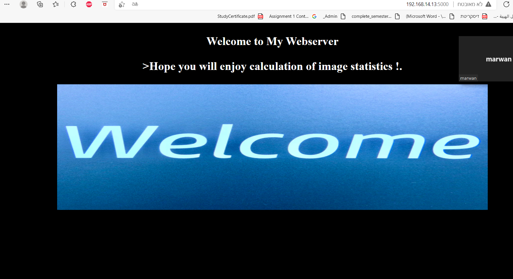
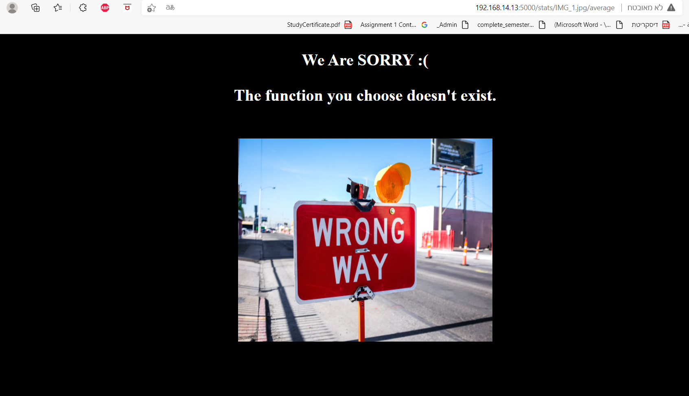
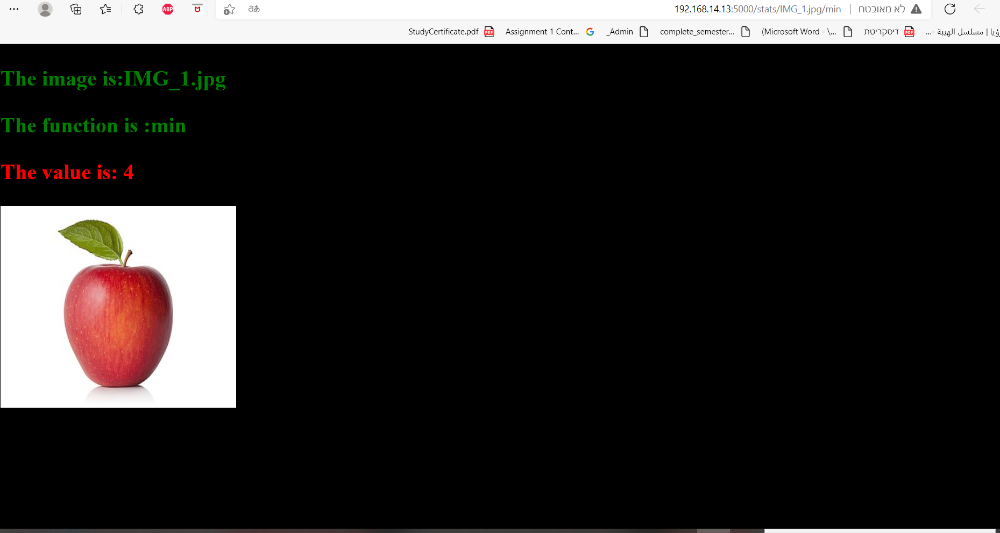

## SEETREE TASK 

Image statistics are common features in AI applications.
In the following assignment you are requested to implement a web server that handles
calculation of image statistics. For example, given an image we would like to calculate the
min,max,mean values etc.
 

The images you are asked to calculate statistics upon are stored in a Cloud Storage Bucket
(similar to ASW S3 service). Requests to your web server will contain file name and the
requested function to calculate. Your service will read the requested image from the bucket,
calculate the requested statistics and return the result in the response

The web server will support the following routes, both will support only GET requests
Supported statistics functions are:
  
*1.* /health : will respond with “OK” to any request
*2.* /stats/IMAGE_FILE_NAME/FUNC_NAME :

FUNC_NAME should be:
**1.** min: computes the minimum of image pixel values
 
**2.** max: computes the maximum of image pixel values
 
**3.** mean: computes the mean/average of image pixel values
 
**4.** median: computes the median/middle of image pixel values
 
**5.** pXXX: where XXX is a percentile between 0...100. For example p10 is the 10th percentile of the image, p99 is the 99th percentile
<

and the IMAGE_FILE_NAME should be:
between IMG_1.jpg …IMG_10.jpg
All the images that should be supported are stored in a bucket named :
seetree-demo-open
https://storage.googleapis.com/seetree-demo-open/FILE_NAME

#### After starting the application you can access the following services at given location:
#### example

**1** http://localhost:5000/: the home page with all the images

 

**2**  http://localhost:5000/stats/IMG_1.jpg/average should respond with 404 error code

 

**3** http://localhost:5000/stats/IMG_100.jpg/min should respond with 404 error code

 

**4** http://localhost:5000/health : will respond with “OK” to any request

 

 **5** http://localhost:5000/stats/IMG_1.jpg/min   respond with the correct min value in the image

 ## Prerequisites

Before you begin You need to have:
**1** Docker: The application tested with Docker Desktop for Windows 
**2** Python: The application tested with Python3
**3** GIT: GITHUB

## Starting application locally 
  Git all the files to a directory in your system.

https://github.com/marwanfursa3/seetree--task

* Run the project in application tested with Python3 :
      
    `pip install -r requirements.txt`
     
    
    
     
* Navigate to this url in your browser:
    
http://localhost:5000/

 
## Starting application locally with Docker

* Run the project in docker with these commands :

    `docker build -t seetree .`
      
     `docker run -id -p 5000:5000 -t seetree`
     
* Navigate to this url in your browser:
    
http://localhost:5000/

 
#### Bonus solution
For the bonus part im using python dictionary data structure as data base to store the new functions requsets in the following format:
 
 `multiple_requests = {"IMAGE_FILE_NAME": {"min": "0", "max": "0", "mean": "0", "median": "0"}}`
  
Everytime the server gets a request it search the data base for identical request, if the result is there return it, if its not compute it and store the new request in the data base.
 
In this way we save time computing identical requests more than once and make it more  efficient.